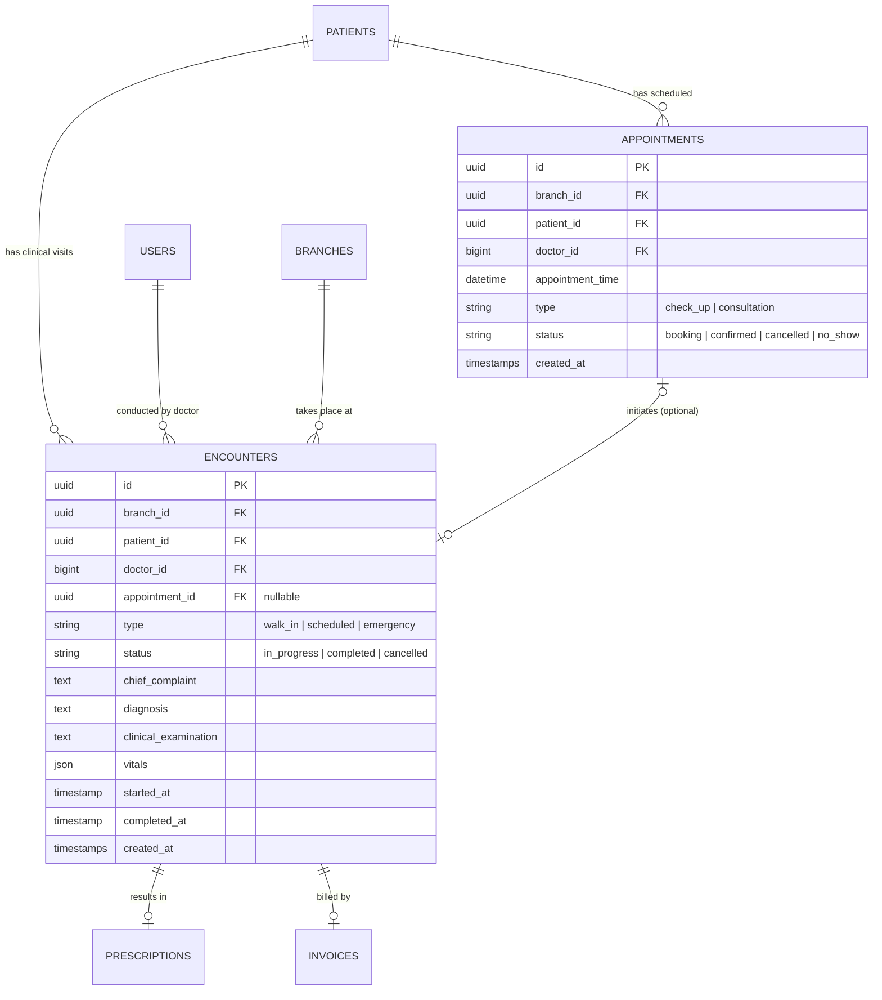
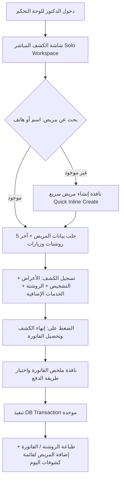

# 🏥 التقرير المعماري الشامل: دعم العيادات الفردية (Solo Doctor) والعيادات المتكاملة (Polyclinic)

> **تاريخ التقرير:** سبتمبر 2026  
> **حالة الوثيقة:** معتمدة وموثقة (Architecture Decision Record - ADR)  
> **الهدف:** توحيد بنية النظام (Unified Core Architecture) ليعمل بنمطين تشغيليين (Solo Mode & Polyclinic Mode) دون تكرار قواعد البيانات أو فصل الأكواد البرمجية، مع إعادة هيكلة الحجوزات والكشوفات.

---

## 📌 الفهرس
1. [المقدمة والمشكلة الأساسية](#1-المقدمة-والمشكلة-الأساسية)
2. [الهيكلة المعمارية لقواعد البيانات: فصل الحجوزات عن الكشوفات](#2-الهيكلة-المعمارية-لقواعد-البيانات-فصل-الحجوزات-عن-الكشوفات)
3. [نظام التشغيل الديناميكي (Clinic Operating Mode)](#3-نظام-التشغيل-الديناميكي-clinic-operating-mode)
4. [دورة العمل الكاملة لنمط الدكتور الفردي (Solo Doctor Workflow)](#4-دورة-عمل-الدكتور-الفردي-solo-doctor-workflow)
5. [المعاملات المالية والفواتير (Billing & Checkout Strategy)](#5-المعاملات-المالية-والفواتير-billing--checkout-strategy)
6. [استراتيجية الأداء والسرعة (Performance & EHR Optimization)](#6-استراتيجية-الأداء-والسرعة-performance--ehr-optimization)
7. [الأمان وعزل البيانات (Security & Multi-Tenancy)](#7-الأمان-وعزل-البيانات-security--multi-tenancy)
8. [شريط متابعة اليوم وإعادة الطباعة (Today's Encounters Panel)](#8-شريط-متابعة-اليوم-وإعادة-الطباعة-todays-encounters-panel)
9. [مقارنة الميزات بين النمطين (Solo vs. Polyclinic Comparison Matrix)](#9-مقارنة-الميزات-بين-النمطين)
10. [خطة التنفيذ البرمجية المقترحة (Implementation Roadmap)](#10-خطة-التنفيذ-البرمجية-المقترحة)

---

## 1. المقدمة والمشكلة الأساسية

### المشكلة:
في السوق الطبي، هناك شريحتان رئيسيتان من العملاء:
1. **العيادة الفردية (Solo Doctor Clinic):** دكتور واحد بدون موظف استقبال، كشف فوري مباشر (Walk-In)، سرعة قصوى، لا حاجة لحجز مواعيد مسبقة أو تنظيم طوابير معقدة.
2. **المركز الطبي / العيادة المجمعة (Polyclinic):** أكثر من دكتور، فروع متعددة، موظفو استقبال (Receptionists)، حجز مواعيد مجدولة وطوابير انتظار وغرفة كشف مستقلة وخزينة منفصلة.

### الحل المعماري المعتمد:
بناء **نظام أساسي موحد (Unified Core Backend)** قادر على التبديل بين النمطين بسلاسة فائقة، بحيث:
* لا يتم إنشاء نسختين من السيستم أو كتابة كود مكرر.
* يتم التحكم في سلوك النظام عبر إعداد المستأجر (`clinic_mode`).
* إعادة هندسة البيانات الطبية للفصل الحاسم بين **"النية بالحجز (Appointment)"** و **"جلسة الكشف الفعلية (Encounter)"**.

---

## 2. الهيكلة المعمارية لقواعد البيانات: فصل الحجوزات عن الكشوفات

### الوضع السابق (Analysis of Legacy Schema):
في ملف [[2026_01_01_000006_create_tenant_appointments_table.php](file:///c:/Users/Mohamed/Desktop/My_saas/ServerSide/database/migrations/tenant/2026_01_01_000006_create_tenant_appointments_table.php)]، تم تخزين البيانات السريرية (`chief_complaint`, `diagnosis`, `vitals`, `clinical_examination`) داخل جدول الحجوزات نفسه (`appointments`).

**عيوب هذا التصميم:**
1. إجبار حالات الكشف المباشر (Walk-In في العيادة الفردية) على إنشاء حجز وهمي فقط من أجل تسجيل التشخيص والروشتة.
2. اختلاط المفاهيم السريرية (Clinical Context) بمفاهيم الجدولة الزمنية (Scheduling Context).
3. عدم القدرة على تمثيل المريض الذي حجز موعداً ولم يحضر (No-show)، أو المريض الذي دخل كشفاً إضافياً في نفس اليوم.

### الهيكل الجديد المعتمد (FHIR-Compliant Healthcare Model):

يتم فصل المفهومين إلى جدولين رئيسيين:



### كيف يخدم هذا التصميم النمطين؟
* **في نمط العيادة الفردية (Solo Mode):**
  * يدخل المريض فوراً -> ينشأ سجل في `encounters` مباشرة بـ `appointment_id = NULL` ونوع `walk_in`.
  * لا يتم لمس جدول `appointments` على الإطلاق، مما يوفر استهلاك قواعد البيانات ويجعل العمليات خفيفة وسريعة.
* **في نمط العيادة الكبيرة (Polyclinic Mode):**
  * يحجز المريض -> ينشأ سجل في `appointments`.
  * يحضر المريض للعيادة ويدخل لغرفة الدكتور -> ينشأ `encounter` مرتبط بـ `appointment_id`.

---

## 3. نظام التشغيل الديناميكي (Clinic Operating Mode)

يتم تخزين وضع العيادة في جدول [[2026_01_01_000005_create_tenant_clinic_settings_table.php](file:///c:/Users/Mohamed/Desktop/My_saas/ServerSide/database/migrations/tenant/2026_01_01_000005_create_tenant_clinic_settings_table.php)]:

```php
$table->string('clinic_mode')->default('solo'); // 'solo' أو 'polyclinic'
```

### آلية العمل عند تسجيل الدخول (Authentication Payload):
عند تسجيل دخول المستخدم، تعيد استجابة الـ Auth الكائن التالي:
```json
{
  "user": {
    "id": 1,
    "name": "د. أحمد خليل",
    "roles": ["doctor"]
  },
  "clinic_settings": {
    "clinic_mode": "solo",
    "default_branch_id": "9b1deb4d-3b7d-4bad-9bdd-2b0d7b3dcb6d",
    "queue_strategy": "fifo"
  }
}
```

### التكيف التلقائي (Automatic Adaptation):
* **في الـ Backend:** 
  * عندما يكون `clinic_mode == 'solo'`، لا تطلب الـ APIs من الواجهة الأمامية إرسال `branch_id` أو `doctor_id`؛ يتم سحبها تلقائياً على السيرفر من بيانات المستخدم الحالي وفرعه الافتراضي.
* **في الـ Frontend:** 
  * يقرأ المتصفح `clinic_mode`، وبناءً عليه يوجه الدكتور تلقائياً إلى **"شاشة الكشف الفوري (Solo Workspace)"** مع إخفاء شاشات الاستقبال، المواعيد المسبقة، وإدارة غرف الانتظار المعقدة.

---

## 4. دورة عمل الدكتور الفردي (Solo Doctor Workflow)



### تفاصيل الخطوات:

### 1. البحث السريع والإنشاء المباشر (Quick Inline Create)
* يبحث الدكتور بالاسم أو الهاتف: `GET /api/v1/patients/search?query=01012345678`.
* يتم استخدام فهارس `B-Tree` على عمودي `phone` و `name` لضمان رد في زمن أقل من 20 مللي ثانية.
* إذا لم يوجد المريض، تفتح نافذة منبثقة سريعة (Drawer/Modal) تطلب:
  - الاسم رباعي
  - رقم الهاتف
  - تاريخ الميلاد / السن
  - الجنس
* عند الحفظ، يُنشأ المريض ويتم فتح شاشة الكشف له فوراً دون مغادرة الصفحة.

### 2. واجهة الكشف الموحدة (Solo Workspace Layout)
تتكون الواجهة من 3 مناطق رئيسية:
1. **الجانب الأيمن (الملخص الطبي السريع للمريض):** الأمراض المزمنة، الحساسية، العمليات السابقة، وآخر روشتات وزيارات.
2. **المنطقة الوسطى (بيانات الزيارة الحالية):** الشكوى الأساسية (`chief_complaint`)، التشخيص (`diagnosis`)، الفحص السريري، وكتابة أصناف الروشتة مع البحث الذكي عن الأدوية والجرعات.
3. **الجانب الأيسر (الخدمات والفاتورة):** قائمة الخدمات السريعة (سعر الكشف الأساسي، سونار، غرز، جلسة استنشاق...) مع الإجمالي المالي لحظياً.

---

## 5. المعاملات المالية والفواتير (Billing & Checkout Strategy)

بناءً على نتائج جلسة الاستيضاح، تم تفضيل **خطوة تأكيد سريعة (Confirmation Modal)** بدلاً من الإغلاق الأعمى:

### نافذة التحصيل السريع (Payment Confirmation Modal):
تظهر للدكتور عند الضغط على `Finish Examination`:
* **بنود الفاتورة:**
  - كشف طبي: 300 ج.م
  - سونار بطن: 200 ج.م
  - **الإجمالي:** 500 ج.م
* **خانة الخصم (Discount):** اختيارية.
* **طريقة الدفع (Payment Method):**
  - [x] نقدي (Cash) - افتراضي
  - [ ] بطاقة ائتمان / شبكة (Visa / POS)
  - [ ] محفظة إلكترونية (Vodafone Cash / InstaPay)
* **زر:** `تأكيد وتحصيل وطباعة (Confirm & Print)`

### السلامة الذرية للمعاملة (Atomic Database Transaction):
تُنفذ كل التغييرات في السيرفر داخل `DB::transaction`:
```php
DB::transaction(function () use ($encounter, $request) {
    // 1. تحديث حالة الزيارة الطبية
    $encounter->update([
        'status' => 'completed',
        'completed_at' => now(),
        'diagnosis' => $request->diagnosis,
        'chief_complaint' => $request->chief_complaint,
        'vitals' => $request->vitals,
    ]);

    // 2. إنشاء الروشتة والأدوية
    if (!empty($request->prescription_items)) {
        $prescription = Prescription::create([
            'patient_id' => $encounter->patient_id,
            'doctor_id' => $encounter->doctor_id,
            'encounter_id' => $encounter->id,
        ]);
        $prescription->items()->createMany($request->prescription_items);
    }

    // 3. إنشاء الفاتورة وعناصرها والتحصيل
    $invoice = Invoice::create([
        'patient_id' => $encounter->patient_id,
        'branch_id' => $encounter->branch_id,
        'encounter_id' => $encounter->id,
        'status' => 'paid',
        'total_amount' => $request->total_amount,
        'paid_amount' => $request->total_amount,
    ]);
    
    // تسجيل بنود الفاتورة (الكشف + الخدمات)
    $invoice->items()->createMany($request->invoice_items);

    // تسجيل الدفعة في جدول المدفوعات
    Payment::create([
        'invoice_id' => $invoice->id,
        'amount' => $request->total_amount,
        'method' => $request->payment_method,
        'paid_at' => now(),
    ]);
});
```
> **فائدة التصميم:** إذا فشلت طباعة أو حفظ أي بند، يتراجع النظام بالكامل (Rollback)، مما يستحيل معه وجود روشتة يتيمة بدون كشف أو فاتورة بدون سداد.

---

## 6. استراتيجية الأداء والسرعة (Performance & EHR Optimization)

### 1. استدعاء السجل المرضي (EHR Fetching Strategy)
* **المشكلة:** إذا دخل مريض قديم لديه 80 كشفاً وروشتة سابقة، فإن جلب كل السجل القديم يؤدي إلى بطء في شبكة الاتصال وضغط غير مبرر على الرام.
* **الحل المعتمد:**
  * **Eager Loading المحدود:** عند اختيار المريض، يُرجع الـ API ملخص الحساسية والأمراض المزمنة مع **آخر 5 زيارات وروشتات فقط**:
    ```php
    $patient->load([
        'encounters' => fn($q) => $q->latest()->limit(5)->with('prescription.items'),
    ]);
    ```
  * **Lazy Loading / Pagination:** يتيح التطبيق للدكتور زراً بعنوان `"عرض الأرشيف القديم"`، يجلب باقي الزيارات على دفعات (صفحات) حسب الحاجة فقط.

### 2. الفهارس الموصى بها (Database Indexing):
* جدول `patients`: فهرس مركب على `(tenant_id, phone)` و `(tenant_id, name)`.
* جدول `encounters`: فهرس مركب على `(branch_id, doctor_id, created_at)` و `(patient_id, created_at)`.
* جدول `prescriptions`: فهرس على `(patient_id, created_at)`.

---

## 7. الأمان وعزل البيانات (Security & Multi-Tenancy)

1. **عزل المستأجرين (Tenant Boundary Isolation):**
   * عبر حزمة `stancl/tenancy`، كل عيادة تعمل في قاعدة بياناتها المستقلة، مما يمنع منعاً باتاً أي تسريب للبيانات بين العيادات.
2. **منع التلاعب بالمعرفات (IDOR Protection):**
   * في وضع `solo`، يتجاهل السيرفر أي `doctor_id` ممرر في الـ Payload، ويفرضه من المستخدم الموثق عبر التوكن:
     `$doctorId = auth()->id();`
3. **صلاحيات متعددة مدمجة للدكتور (Dynamic Role Capabilities):**
   * دكتور العيادة الفردية يحمل الصلاحيات السريرية والمالية معاً (`prescribe-drugs`, `create-invoices`, `collect-payments`) دون الحاجة لتغيير الـ Role الأساسي.

---

## 8. شريط متابعة اليوم وإعادة الطباعة (Today's Encounters Panel)

حرصاً على ألا يفقد الدكتور سياق اليوم، تشتمل شاشة `Solo Workspace` على شريط جانبي/سفلي قابل للطي بعنوان **"كشوفات اليوم"**:
* **إحصائيات فورية:** (عدد كشوفات اليوم: 18 | إجمالي التحصيل: 6400 ج.م).
* **قائمة بالمرضى الذين تم الكشف عليهم اليوم مرتبة تنازلياً حسب الوقت.**
* **إجراءات سريعة لكل مريض بنقرة واحدة:**
  - 🖨️ **طباعة الروشتة:** طباعة ورقية بحجم A4/A5 أو إرسال فوري إلى واتساب المريض (PDF).
  - 🧾 **طباعة إيصال الفاتورة:** طباعة إيصال استلام حراري (Thermal 80mm).
  - ✏️ **تعديل الكشف:** إمكانية تعديل التشخيص أو الجرعات خلال 24 ساعة في حال تذكر الدكتور معلومة إضافية.

---

## 9. مقارنة الميزات بين النمطين

| الميزة / الإجراء | نمط العيادة الفردية (Solo Mode) | نمط العيادة المتكاملة (Polyclinic Mode) |
| :--- | :--- | :--- |
| **إنشاء المريض** | إنزلاقي فوري (Quick Inline Create) داخل شاشة الكشف | شاشة إدارة المرضى والاستقبال من الريسبشن |
| **الحجوزات المسبقة** | غير مفعلة (مباشر Walk-in دائماً) | مفعلة (جدول مواعيد وفترات حجز ومواعيد حضور) |
| **طابور الانتظار (Queue)** | غير معقد (قائمة كشوفات اليوم) | طابور كامل (حجز -> انتظار -> كشف -> صيدلية/خزينة) |
| **تسجيل الكشف والتشخيص** | في جدول `encounters` (مع `appointment_id = NULL`) | في جدول `encounters` (مرتبط بـ `appointment_id`) |
| **الدورة المالية** | تحصيل فوري وتأكيد فاتورة بنقرة واحدة من الدكتور | إصدار الفاتورة بالريسبشن/الخزينة وتحصيلها منفصلاً |
| **الفروع والأطباء** | افتراضية تلقائية (من المستخدم المسجل) | اختيار يدوي وتوزيع للمرضى حسب الطبيب والفرع |
| **كود النظام الأساسي** | **نفس الكود وقواعد البيانات** | **نفس الكود وقواعد البيانات** |

---

## 10. خطة التنفيذ البرمجية المقترحة (Implementation Roadmap)

عند اتخاذ قرار البدء في التطبيق مستقبلاً، ستتبع الخطوات التالية:

### الخطوة 1: تعديل قواعد البيانات (Migrations)
1. إنشاء migration لجدول `encounters` بالهيكل الجديد.
2. إضافة عمود `clinic_mode` في جدول [[clinic_settings](file:///c:/Users/Mohamed/Desktop/My_saas/ServerSide/database/migrations/tenant/2026_01_01_000005_create_tenant_clinic_settings_table.php)].
3. نقل الحقول السريرية من جدول `appointments` إلى `encounters` وجعل `appointment_id` في جدول الكشوفات حقلاً اختيارياً (`nullable`).

### الخطوة 2: طبقة الخدمات البرمجية (Service Layer)
1. إنشاء `EncounterService` لإدارة فتح الكشف، والربط بالروشتة، وإغلاقه في `DB::transaction`.
2. إنشاء `QuickPatientService` لتسجيل المرضى السريع.

### الخطوة 3: طبقة الـ API (Controllers & Routes)
1. مسار البحث السريع: `GET /api/v1/patients/search`.
2. مسار الكشف المباشر للدكتور الفردي: `POST /api/v1/encounters/walk-in-complete`.
3. مسار كشوفات وإيراد اليوم: `GET /api/v1/encounters/today-summary`.

### الخطوة 4: واجهة المستخدم (Frontend UI)
1. بناء مكون `SoloWorkspaceView` لدمج البحث، التشخيص، الروشتة، والفاتورة في شاشة واحدة.
2. بناء نافذة `PaymentCheckoutModal`.
3. بناء شريط `TodayEncountersDrawer`.

---

> 📝 **خاتمة:**  
> بهذا المخطط، يمتلك مشروعك الآن رؤية هندسية احترافية توافق أعلى معايير البرمجيات الصحية، وتتيح لك بيع النظام لعيادة طبيب بمفرده أو لمستشفى وعيادات مجمعة بنفس الكود وبكل سهولة.
